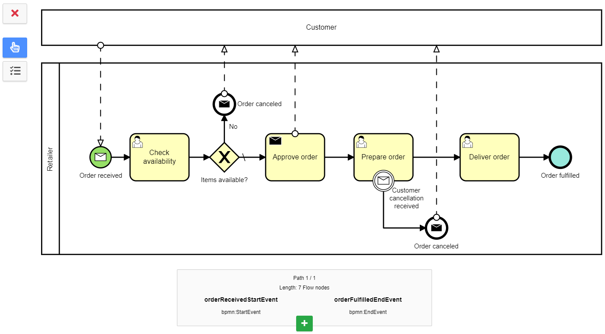
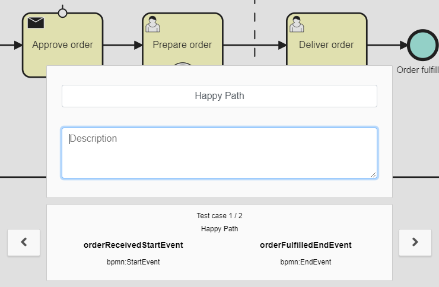
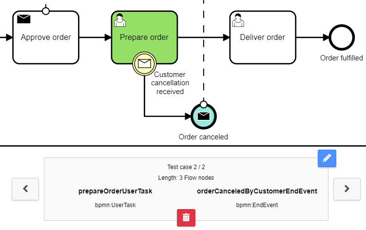
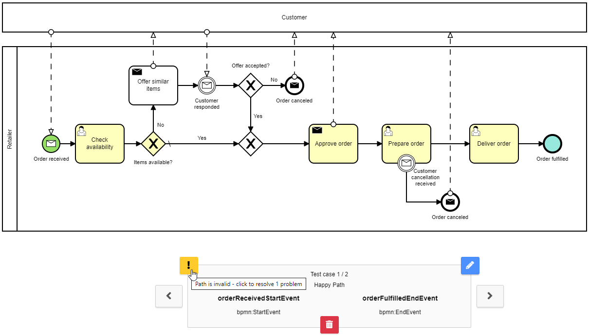

# BPMN Driven Testing
[](https://github.com/camunda-community-hub/community)
[](https://github.com/Camunda-Community-Hub/community/blob/main/extension-lifecycle.md#incubating-)

[](https://central.sonatype.com/artifact/org.camunda.community/bpmn-driven-testing-maven-plugin/0.7.0/versions)
[](https://central.sonatype.com/artifact/org.camunda.community/bpmn-driven-testing-gradle-plugin/0.7.0/versions)

[Camunda Platform 7](https://docs.camunda.org/manual/latest/) extension, which is able to generate test code based on an extended BPMN model.

The extension lets the developer focus on testing the business logic, rather than writing boilerplate code.
The generated test code handles process instance start at any selected flow node and advances a process instance in case of wait states.
Since the test code is generated, there is no need to deal with process definition keys and flow node IDs.
Moreover any breaking changes (e.g. a user task becomes an external task) in the BPMN process will already be visible at design time as test compile errors.

The extension consists of:

- [Camunda Modeler plugin](camunda-modeler-plugin) for a visual selection and the management of test cases
- [Maven plugin](maven-plugin) / [Gradle plugin](gradle-plugin) for generation of JUnit 4 or 5 based test code

## Features
- Visual test case selection
- Automatic path finding with
  - Support for embedded sub processes
  - Support for boundary events
  - BPMN collaborations with one expanded participant
  - Loop detection
- Generated test cases provide
  - Automatic handling of wait states
  - Call activity stubbing for isolated testing - see [test](integration-tests/advanced/src/test/java/org/example/it/CallActivityWithMappingTest.java)
  - [Fluent API](impl/src/main/java/org/camunda/community/bpmndt/api) to override default behavior
  - Multi instance (activity/embedded subprocess) support - see [integration tests](integration-tests/advanced-multi-instance/src/test/java/org/example/it)
- Spring test support - see [integration tests](integration-tests/advanced-spring/)
- Spring Boot test support - see [integration tests](integration-tests/advanced-spring-boot/)
- Testing of arbitrary paths through a BPMN process
- Test case validation and migration, when a BPMN process was changed - see [docs](docs/test-case-validation-and-migration.md)

## How does it work?

### Select test cases
After modeling, a developer uses the Camunda Modeler plugin to define suitable test cases by selecting a start and an end flow node.
The modeler plugin finds all possible paths through the BPMN process. Each path can be added as a test case.



Optionally a test case can be named and described. Names and descriptions are reflected in the generated test code.



When the BPMN model is saved, the selected test cases are attached to the BPMN process in form of a custom extension element.

```xml
<bpmn:process id="order-fulfillment" isExecutable="true">
  <bpmn:extensionElements>
    <bpmndt:testCases>
      <bpmndt:testCase>
        <bpmndt:name>Happy Path</bpmndt:name>
        <bpmndt:path>
          <bpmndt:node>orderReceivedStartEvent</bpmndt:node>
          <bpmndt:node>checkAvailabilityUserTask</bpmndt:node>
          <bpmndt:node>Gateway_0dw0zxn</bpmndt:node>
          <bpmndt:node>approveOrderSendTask</bpmndt:node>
          <bpmndt:node>prepareOrderUserTask</bpmndt:node>
          <bpmndt:node>deliverOrderUserTask</bpmndt:node>
          <bpmndt:node>orderFulfilledEndEvent</bpmndt:node>
        </bpmndt:path>
      </bpmndt:testCase>
    </bpmndt:testCases>
  </bpmn:extensionElements>

  <!-- ... -->
</bpmn:process>
```

### Generate test code
To generate the code for the selected test cases, a developer must run the **generator** goal of the [bpmn-driven-testing-maven-plugin](maven-plugin) - in **Eclipse** select the project and press **ALT+F5** to update.
The goal finds all *.bpmn files under `src/main/resources` and looks for BPMN processes with a `bpmndt:testCases` extension element.
Each test case will result in a [JUnit 4 test rule](https://github.com/junit-team/junit4/wiki/Rules) or [JUnit 5 extension](https://junit.org/junit5/docs/current/api/org.junit.jupiter.api/org/junit/jupiter/api/extension/Extension.html) - in this example: `generated.order_fulfillment.TC_Happy_Path`.

### Implement tests
In this example, `TC_Happy_Path` must be imported and either used as a JUnit 4 test rule (a `public` field, which is annotated with `@Rule`)

```java
@Rule
public TC_Happy_Path tc = new TC_Happy_Path();
```

or as a JUnit 5 extension (a `public` field, which is annotated with `@RegisterExtension`),
if `jUnit5Enabled` is set to `true` in the plugin's [configuration](maven-plugin#configuration)

```java
@RegisterExtension
public TC_Happy_Path tc = new TC_Happy_Path();
```

Calling `createExecutor()` on the test rule, provides a fluent API,
which is used to specify variables, business key and/or [beans](https://docs.camunda.org/manual/latest/user-guide/testing/#resolving-beans-without-spring-cdi) that are considered during test case execution.
After the specification, `execute()` is called to create a new process instance and exeute the test case.

Moreover the default behavior of wait states and call activities can be adjusted using fluent APIs.
For each applicable flow node a "handle*" method is generated - for example: `handleCheckAvailabilityUserTask()`.

```java
import org.junit.Rule;
import org.junit.Test;

import generated.order_fulfillment.TC_Happy_Path;

public class OrderFulfillmentTest {

  @Rule
  public TC_Happy_Path tc = new TC_Happy_Path();

  @Test
  public void testItemsAvailable() {
    // fluent API for user task "checkAvailabilityUserTask"
    tc.handleCheckAvailabilityUserTask()
      .verify((pi, task) -> {
        // verify wait state
        pi.variables().containsEntry("customerId", 123);

        task.hasCandidateGroup("group-xyz");
      })
      .withVariable("available", true)
      .complete();

    // enrich and execute test case
    tc.createExecutor()
      .withBusinessKey("order-20210623-0001")
      .withVariable("customerId", 123)
      .withVariable("customerType", "NEW")
      .withBean("approveOrder", new ApproveOrderDelegate())
      .verify(pi -> {
        // verify state after execution
        pi.isEnded();
      })
      .execute();
  }
}
```

When a test is started, the generated code handles the creation of the process engine as well as the process definition deployment.
On the other hand, the test case execution handles the process instance start, applies the specified behavior and verifies that the process instance has passed the correct activities.

A developer can solely focus on the actual implementation!

## More screenshots

|  | 
|:--:| 
| *Arbitrary paths* |

|  | 
|:--:| 
| *Test case validation* |
