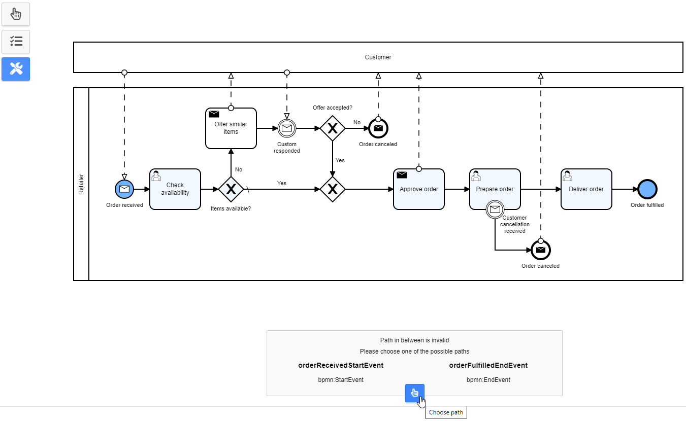
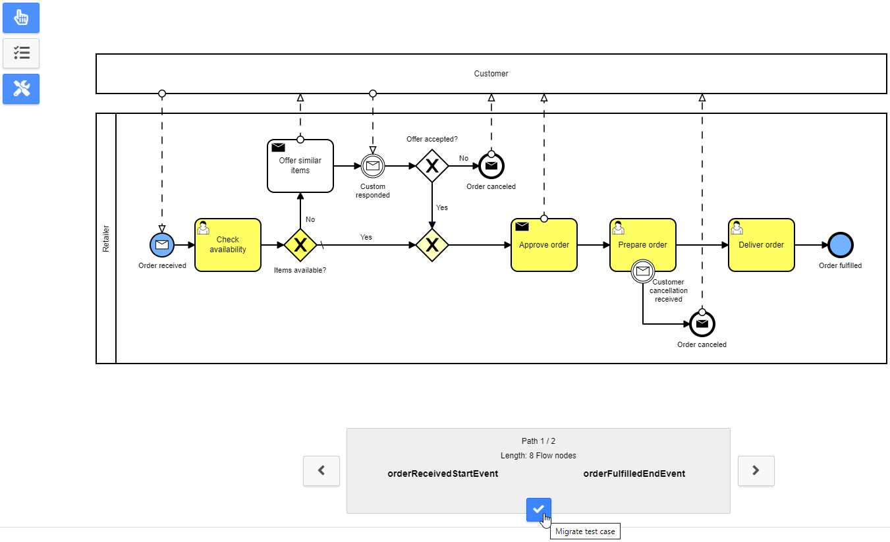

# Feature: Test case validation and migration
When a BPMN process evolves (e.g. flow nodes are added, removed or changed in their sequence), already selected test cases may become invalid.

## How does it work?
When the Camunda modeler plugin is activated (toggled), the path of every test case is validated.
If at least one of the flow nodes does not exist anymore, one or multiple problems are issued and the test case is flagged as invalid.

### Problem types

| Problem                      | Required action                          |
|:-----------------------------|:-----------------------------------------|
| Start node is missing        | Select a new start node                  |
| End node is missing          | Select a new end node                    |
| Path in between is invalid   | Choose between one of the possible paths |
| Path problem is unresolvable | Select a new path                        |

### Migration mode
In the migration mode, the encountered problems can be resolved in any order. The BPMN model marks the currently selected problem:

- Bright blue colored: the problem's start and/or end node
- Light blue colored: nodes of the invalid path that are still existing

### Selection mode
In the selection mode, a specific action depending on the problem type (e.g. selection of a new end node, or choosing between possible paths) must be performed to migrate the path of the test case. Again the BPMN model marks the problem:

- Bright blue colored: the problem's start and/or end node
- When a selection is done, bright yellow colored: nodes that are present in the invalid and in the new path
- When a selection is done, light yellow colored: new nodes that are not present in the invalid path

### Automatic problem resolving
When a path in between is invalid and there is only one new path between those nodes possible, the test case will be **migrated automatically without any user interaction**.
